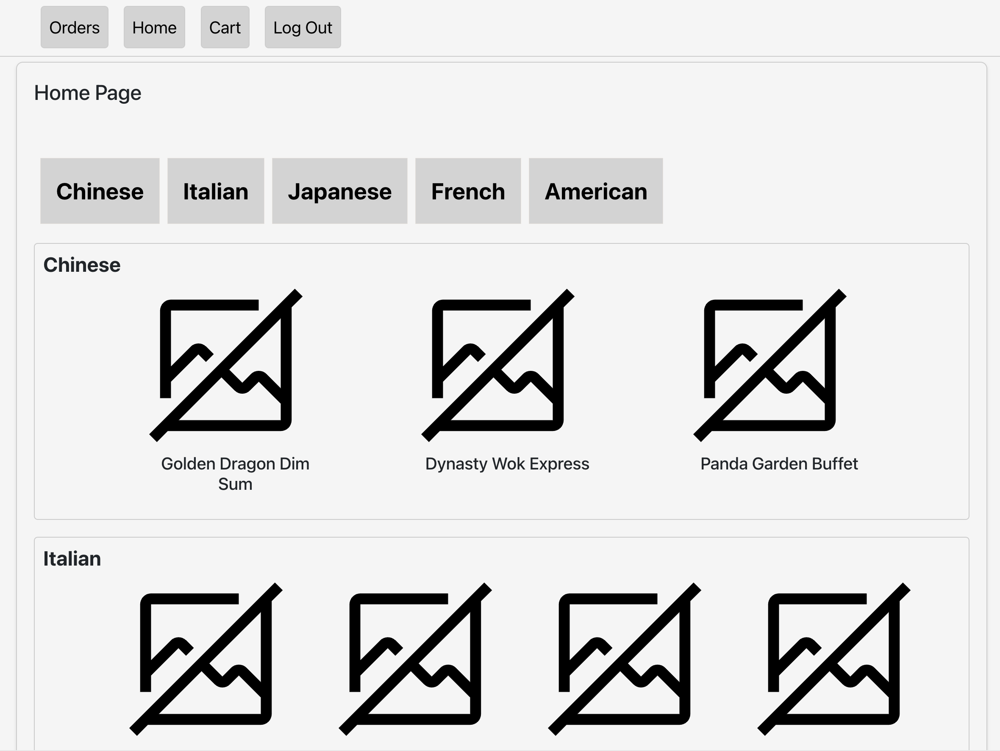
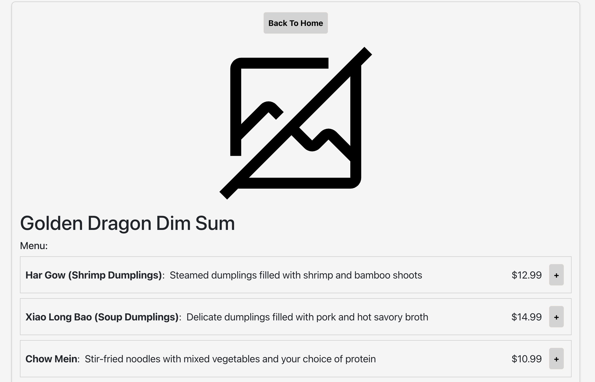
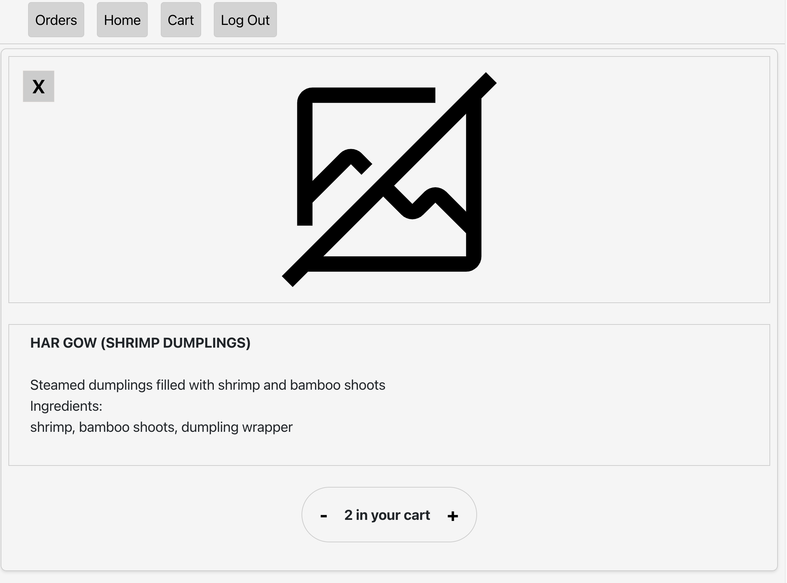
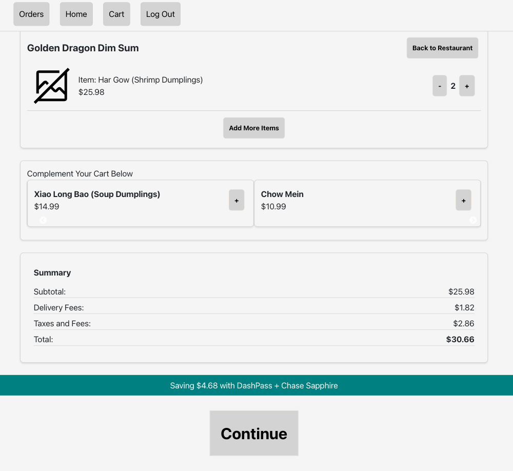
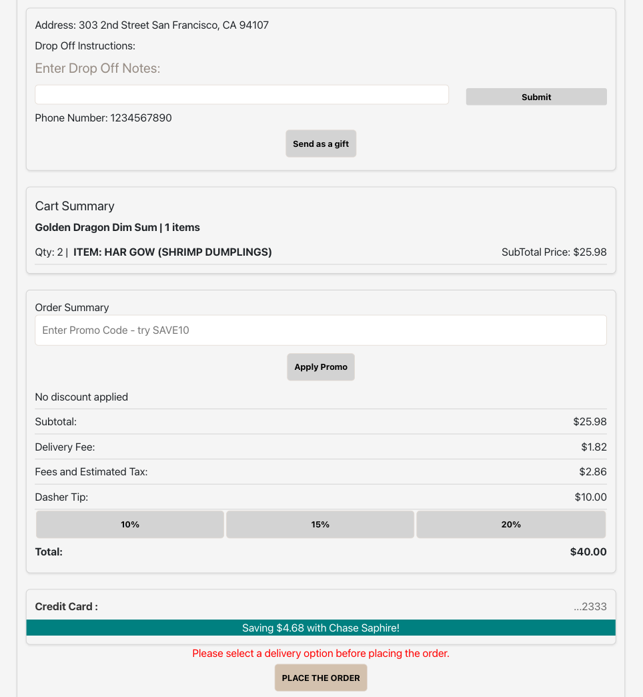
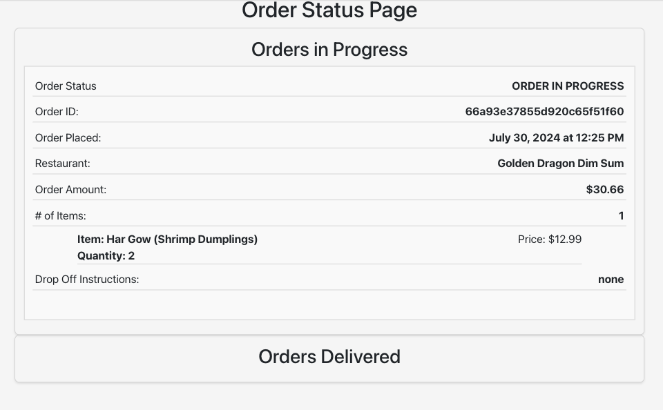

# MockDoorDash
# <strong><em>[MockDoorDash](https://mock-door-dash-a506924dcc36.herokuapp.com/)</em></strong>: An application that has been built using the MERN stack (Mongo, Express, React, Node) that simulates the user's perspective searching for food, and placing an order.

## Motivation
This project was an opportunity to deepen my understanding of React, database design, and APIs. Reverse-engineering DoorDash and implementing a similar workflow was a rewarding experience. The most challenging aspect was integrating the Google Maps API, especially since the project uses a now-deprecated version. This challenge highlighted my initial lack of experience with APIs, which was a key motivation for this project.

Through this project, I gained valuable insights into React's timing and batch updates, enhancing my comprehension of data management and manipulation in web applications.

 ## Technologies Used

## MockDoorDash Overview
This web app has several pages:

Home Page: Displays all available restaurants.

Restaurant Page: Provides detailed information about the selected restaurant.

Item Page: Shows ingredients and descriptions of dishes.

Cart Summary Page: Summarizes the current cart and suggests additional items.

Checkout Page: Finalizes the order.

Order History Page: Lists past orders.

These pages facilitate a seamless user experience from browsing to placing an order.

## Next Steps
The next addition to this project will include working on creating a function that takes an order that has been placed, but set for delivery in the future, and then triggers the 'delivery' process at that given time. 

